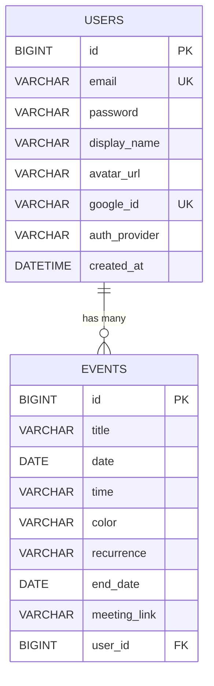

<p align="center">
  
</p>

<h1 align="center">🗓️ Warm Calendar</h1>

<p align="center">
  <strong>A beautiful, modern personal calendar application</strong>
</p>

<p align="center">
  <a href="#-features"></a>
  <a href="#-tech-stack"></a>
  <a href="#-getting-started"></a>
</p>

<p align="center">
  
  
  
  
  
</p>

---

## ✨ Features

<table>
  <tr>
    <td align="center" width="25%">
      
      <br><strong>📅 Month & Week Views</strong>
      <br><sub>Switch between different calendar views seamlessly</sub>
    </td>
    <td align="center" width="25%">
      
      <br><strong>🖱️ Drag & Drop</strong>
      <br><sub>Easily reschedule events with intuitive drag and drop</sub>
    </td>
    <td align="center" width="25%">
      
      <br><strong>🔁 Recurring Events</strong>
      <br><sub>Set up daily, weekly, or monthly recurring events</sub>
    </td>
    <td align="center" width="25%">
      
      <br><strong>🔗 Meeting Links</strong>
      <br><sub>Attach video meeting links to your events</sub>
    </td>
  </tr>
  <tr>
    <td align="center" width="25%">
      
      <br><strong>🔐 Google Sign-In</strong>
      <br><sub>Quick and secure authentication with Google</sub>
    </td>
    <td align="center" width="25%">
      
      <br><strong>📧 Email/Password</strong>
      <br><sub>Traditional login with email and password</sub>
    </td>
    <td align="center" width="25%">
      
      <br><strong>🖼️ Profile Settings</strong>
      <br><sub>Update display name & upload avatars from your PC</sub>
    </td>
    <td align="center" width="25%">
      
      <br><strong>☁️ Cloud Sync</strong>
      <br><sub>Your events are safely stored in MySQL</sub>
    </td>
  </tr>
</table>

---

## 🛠️ Tech Stack

<table>
  <tr>
    <th align="center">🎨 Frontend</th>
    <th align="center">⚙️ Backend</th>
    <th align="center">🗃️ Database</th>
    <th align="center">🔒 Security</th>
  </tr>
  <tr>
    <td>
      <ul>
        <li>React 18</li>
        <li>TypeScript</li>
        <li>TailwindCSS</li>
        <li>shadcn/ui</li>
        <li>Lucide Icons</li>
      </ul>
    </td>
    <td>
      <ul>
        <li>Spring Boot 3.x</li>
        <li>Java 17</li>
        <li>Spring Data JPA</li>
        <li>Lombok + Slf4j</li>
      </ul>
    </td>
    <td>
      <ul>
        <li>MySQL 8.x</li>
        <li>Local Uploads</li>
        <li>Hibernate</li>
      </ul>
    </td>
    <td>
      <ul>
        <li>Spring Security</li>
        <li>Session Management</li>
        <li>Google OAuth 2.0</li>
        <li>BCrypt Hashing</li>
      </ul>
    </td>
  </tr>
</table>

---

## 🏗️ Architecture

```
┌─────────────────────────────────────────────────────────────────┐
│                       📱 Frontend (React)                       │
│  ┌─────────────┐  ┌─────────────┐  ┌─────────────────────────┐ │
│  │ Calendar UI │  │ AuthContext │  │    useCalendarEvents    │ │
│  └──────┬──────┘  └──────┬──────┘  └────────────┬────────────┘ │
│         └────────────────┼──────────────────────┘              │
│                          ▼                                      │
│                    ┌──────────┐                                 │
│                    │  api.ts  │                                 │
│                    └────┬─────┘                                 │
└─────────────────────────┼───────────────────────────────────────┘
                          │ HTTP/REST (Credentials: include)
                          ▼
┌─────────────────────────────────────────────────────────────────┐
│                    ⚙️ Backend (Spring Boot)                     │
│  ┌─────────────────────────┐   ┌─────────────────────────────┐ │
│  │    Auth Module          │   │      Event Module           │ │
│  │  ┌───────────────────┐  │   │  ┌───────────────────────┐  │ │
│  │  │  AuthController   │  │   │  │   EventController     │  │ │
│  │  │        ↓          │  │   │  │         ↓             │  │ │
│  │  │   AuthService     │  │   │  │    EventService       │  │ │
│  │  └───────────────────┘  │   │  └───────────────────────┘  │ │
│  └─────────────────────────┘   └──────────────┬──────────────┘ │
│                │                              │                │
│                ▼                              ▼                │
│        ┌───────────────┐              ┌────────────────┐       │
│        │ User Repos    │              │ Event Repos    │       │
│        └───────────────┘              └────────────────┘       │
└─────────────────────────────────┬───────────────────────────────┘
                                  │ JPA/Hibernate
                                  ▼
                        ┌───────────────────┐
                        │   🗃️ MySQL 8.x    │
                        └───────────────────┘
```

---

## 📊 Database Schema



---

## 🚀 Getting Started

### Prerequisites

- **Java 17+**
- **Node.js 18+**
- **MySQL 8.x**

### 1️⃣ Clone the Repository

```powershell
git clone https://github.com/GiangQuan/warm-calendar.git
cd warm-calendar
```

### 2️⃣ Database Setup

Create a database named `admin_calendar` in your MySQL server. Update `application.properties` with your credentials:

```properties
spring.datasource.url=jdbc:mysql://localhost:3306/admin_calendar
spring.datasource.username=your_username
spring.datasource.password=your_password
```

### 3️⃣ Run the Backend

```powershell
cd backend/backend
.\mvnw.cmd spring-boot:run
```

🌐 Backend runs at: **http://localhost:8080**

### 4️⃣ Run the Frontend

```powershell
cd frontend
npm install
npm run dev
```

🌐 Frontend runs at: **http://localhost:5173**

---

## 📡 API Reference

### 🔐 Auth & Profile

| Method | Endpoint             | Description                |
| :----: | -------------------- | -------------------------- |
| `POST` | `/api/auth/register` | Register new account       |
| `POST` | `/api/auth/login`    | Login with email/password  |
| `GET`  | `/api/auth/me`       | Get current logged-in user |
| `PUT`  | `/api/auth/update`   | Update name & avatar URL   |
| `POST` | `/api/upload/avatar` | Upload image from computer |

### 📅 Events

|  Method  | Endpoint                  | Description       |
| :------: | ------------------------- | ----------------- |
|  `GET`   | `/api/events?userId={id}` | Get user's events |
|  `POST`  | `/api/events`             | Create new event  |
|  `PUT`   | `/api/events/{id}`        | Update event      |
| `DELETE` | `/api/events/{id}`        | Delete event      |

---

## 👥 Team

<table>
  <tr>
    <td align="center">
      <strong>GiangQuan</strong>
      <br>
      <sub>🎨 Frontend + PM</sub>
      <br>
      <code>main</code>
    </td>
    <td align="center">
      <strong>Thu Trang</strong>
      <br>
      <sub>🔐 Backend Auth</sub>
      <br>
      <code>backend-auth</code>
    </td>
    <td align="center">
      <strong>Tien Son</strong>
      <br>
      <sub>📅 Backend Events</sub>
      <br>
      <code>backend-events</code>
    </td>
  </tr>
</table>

---

## 📁 Project Structure

```
warm-calendar/
├── 📂 frontend/          # React + TypeScript + Vite
│   ├── src/
│   │   ├── components/   # UI Components
│   │   ├── pages/        # Page components
│   │   ├── hooks/        # Custom React hooks
│   │   ├── contexts/     # React contexts
│   │   └── api.ts        # API client
│
├── 📂 backend/           # Spring Boot application
│   └── backend/
│       └── src/main/java/com/example/backend/
│           ├── controller/   # REST Controllers
│           ├── service/      # Business logic
│           ├── repository/   # Data access
│           ├── entity/       # JPA Entities
│           ├── dto/          # Data Transfer Objects
│           └── config/       # Configuration
│
└── 📂 docs/              # Documentation
    ├── PROJECT_BRIEF.md
    ├── SETUP_GUIDE.md
    └── TEAM_OVERVIEW.md
```

---

## 🔧 Troubleshooting

<details>
<summary><strong>❌ "JAVA_HOME is not set"</strong></summary>

Install Java 17 and set the `JAVA_HOME` environment variable:

```powershell
# Check if Java is installed
java -version

# Set JAVA_HOME (Windows)
setx JAVA_HOME "C:\Program Files\Java\jdk-17"
```

</details>

<details>
<summary><strong>❌ "Port 8080 already in use"</strong></summary>

Find and kill the process using port 8080:

```powershell
netstat -ano | findstr :8080
taskkill /PID <PID_NUMBER> /F
```

</details>

<details>
<summary><strong>❌ "Cannot connect to database"</strong></summary>

- Check your internet connection
- Verify database credentials in `application.properties`
- Ensure the remote database server is accessible
</details>

---

## 📜 License

This project is licensed under the MIT License.

---

<p align="center">
  Made with ❤️ by the <strong>Warm Calendar Team</strong>
</p>

<p align="center">
  <a href="#-warm-calendar">⬆️ Back to Top</a>
</p>
