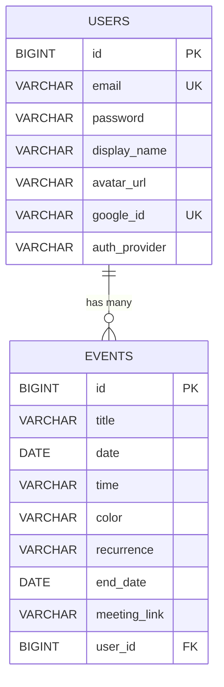

# PROJECT BRIEF - Warm Calendar App

## Mục tiêu dự án
Xây dựng một **Personal Calendar App**:
- Frontend: **React.js** (đã có sẵn UI)
- Backend: **Spring Boot** (cần build mới)
- Database: **MySQL** (mentor cung cấp)

---

## Tech Stack

| Layer | Technology |
|-------|------------|
| Frontend | React 18 + TypeScript + Vite |
| UI Library | shadcn/ui + TailwindCSS |
| Backend | Spring Boot 3.x + Java 17 |
| Database | MySQL 8.x |
| Auth | Email/Password + Google OAuth |

---

## Database Info

| Setting | Value |
|---------|-------|
| Host | `103.150.125.181` |
| User | `admin_calendar` |
| Password | `G8PXH0Vpzf` |

---

## Database Schema



---

## API Endpoints

### Auth (Thu Trang)
| Method | Endpoint | Mô tả |
|--------|----------|-------|
| POST | `/api/auth/register` | Đăng ký tài khoản |
| POST | `/api/auth/login` | Đăng nhập |
| POST | `/api/auth/google` | Đăng nhập Google |

### Events (Tien Son)
| Method | Endpoint | Mô tả |
|--------|----------|-------|
| GET | `/api/events?userId={id}` | Lấy events của user |
| POST | `/api/events` | Tạo event mới |
| PUT | `/api/events/{id}` | Cập nhật event |
| DELETE | `/api/events/{id}` | Xóa event |

---

## Phân công team

| Người | Vai trò | Branch | Nhiệm vụ chính |
|-------|---------|--------|----------------|
| **GiangQuan** | Frontend + PM | `main` | React, setup, review |
| **Thu Trang** | Backend Auth | `backend-auth` | User, Login, Google |
| **Tien Son** | Backend Event | `backend-events` | CRUD Events |

---

## Timeline (5 ngày)

| Ngày | Ai làm | Việc cần làm |
|------|--------|--------------|
| Day 1 | Leader | Setup GitHub, Database, Google OAuth |
| Day 2-4 | Tất cả | Code song song |
| Day 5 | Tất cả | Merge, test, demo |

---

## Cách chạy project

### Backend
```bash
cd backend
./mvnw spring-boot:run
# Server chạy ở http://localhost:8080
```

### Frontend
```bash
npm install
npm run dev
# App chạy ở http://localhost:5173
```

---

## Features

- [x] Month/Week view
- [x] Drag & drop events
- [x] Add/Edit/Delete events
- [x] Recurring events
- [x] Meeting links
- [ ] Persist data to MySQL
- [ ] Google Login
- [ ] Email/Password Login
