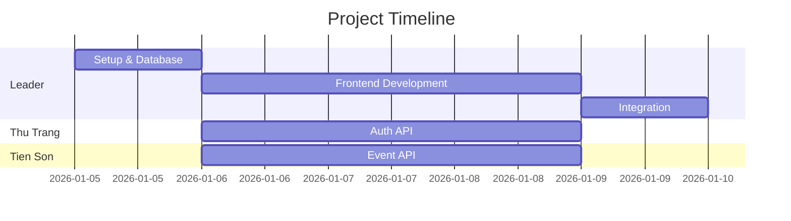
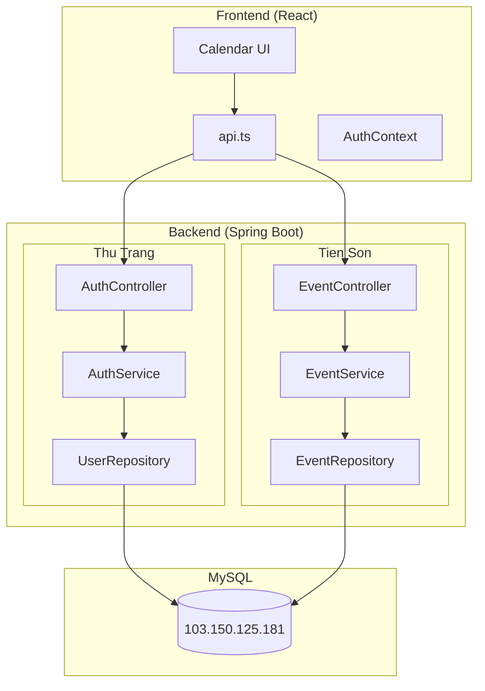
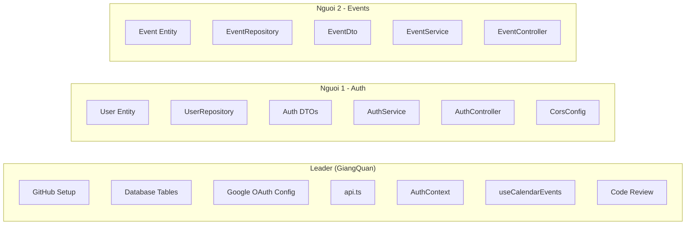

# Team Plan Overview

## Team Members
| Vai trò | Người | Branch | Trách nhiệm |
|---------|-------|--------|-------------|
| Backend Auth | Thu Trang | `backend-auth` | User, Login, Google OAuth |
| Backend Event | Tien Son | `backend-events` | Events CRUD API |
| Frontend + PM | **Bạn** | `main` | React, API integration, quản lý team |

---

## Timeline (5 ngày)



---

## Kiến trúc hệ thống



---

## Task Documents
| File | Cho ai |
|------|--------|
| [LEADER_TASKS.md](./LEADER_TASKS.md) | Bạn (Frontend + PM) |
| [FRIEND1_BACKEND_TASKS.md](./FRIEND1_BACKEND_TASKS.md) | Thu Trang (Auth) |
| [FRIEND2_BACKEND_TASKS.md](./FRIEND2_BACKEND_TASKS.md) | Tien Son (Events) |

---

## Phân chia công việc

| Task | Leader | Nguoi 1 | Nguoi 2 |
|------|:------:|:-------:|:-------:|
| GitHub Setup | ● | | |
| Database Schema | ● | | |
| Google Cloud Config | ● | | |
| User Entity | | ● | |
| Event Entity | | | ● |
| UserRepository | | ● | |
| EventRepository | | | ● |
| AuthService | | ● | |
| EventService | | | ● |
| AuthController | | ● | |
| EventController | | | ● |
| CorsConfig | | ● | |
| api.ts | ● | | |
| AuthContext | ● | | |
| useCalendarEvents | ● | | |
| Code Review | ● | | |
| Integration | ● | | |



---

## Git Branches
```
main (protected)
├── backend-auth (Thu Trang)
├── backend-events (Tien Son)
```

